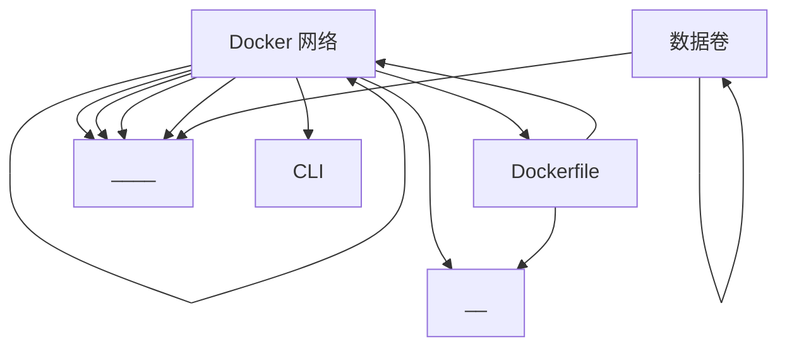

# 02. 核心概念

本文档介绍 Docker容器技术 的核心概念。

## 概念关系图




## 1. 🔴 Docker 容器

**重要程度**: high

**一句话定义**: 容器是镜像运行时的动态实例，可以执行操作独立于host os。

**相关概念**: Docker 镜像, Dockerfile


## 1. 概念定义
Docker容器技术是一种轻量级的虚拟化技术，它允许开发者将应用及其依赖打包到一个轻量级、可移植的容器中，然后可以在任何支持Docker的系统上运行。这类似于生活中的行李箱，每个行李箱代表一个Docker容器，包含所需的衣物、鞋子等个人物品，行李箱可以在不同的旅行目的地使用，而不受目的地环境的限制。

## 2. 核心原理
Docker容器技术的底层原理主要依赖于Linux的内核特性，如cgroups和namespaces。

- **工作机制**：Docker容器通过Docker引擎管理，引擎通过Cgroups技术限制容器资源的使用（CPU、内存等），保证容器内的资源不会超出分配的限额；而通过Namespaces技术实现容器与容器、容器与宿主机之间的隔离，使得容器看起来像一个独立的系统。

- **关键技术点**：
  - **Cgroups**：控制组，是一种限制和管理一个进程组所使用的物理资源（CPU、内存、磁盘I/O等）的机制。
  - **Namespaces**：命名空间，为容器提供隔离的环境，每个容器有自己独立的网络、进程、文件系统等。
  - **Docker镜像**：Docker容器的静态模板，包含了运行一个应用所需的代码、运行时、系统库和环境设置。

- **与其他组件的关系**：Docker引擎是管理容器的大脑，容器镜像是容器的构建蓝图，Docker容器则是根据镜像构建的具体的运行实例。Docker容器与镜像之间是实例与模板的关系。

## 3. 使用场景
1. **持续集成/持续部署（CI/CD）**：自动构建新的Docker镜像并运行，以实现快速迭代和测试。
2. **微服务架构**：在微服务中，每个服务可以独立运行在不同的容器中，便于管理和扩展。
3. **多环境一致性**：在开发、测试和生产环境中保持一致的运行环境，减少环境差异导致的错误。
4. **资源利用率优化**：在同一宿主机上运行多个容器，提高了硬件资源的利用率。
5. **快速扩展和迁移**：容器可以快速启动和停止，便于在云环境中快速扩展和迁移。

## 4. 实际示例
```bash
# 拉取官方的Ubuntu镜像
docker pull ubuntu

# 基于Ubuntu镜像启动一个新的容器
docker run -it --name myubuntu ubuntu /bin/bash
```
注释：这个命令会从Docker Hub拉取Ubuntu的基础镜像，并启动一个新的名为myubuntu的容器，用户可以通过`/bin/bash`进入容器的shell。`-it`参数使得容器可以在交互模式下运行，允许用户与容器内部进行交互。

## 5. 常见误区
1. **Docker容器与虚拟机相同**：这是常见的误区，实际上Docker容器是一种更加轻量级和高效的虚拟化技术，它不需要模拟硬件，可以直接在宿主机的操作系统上运行。
2. **所有操作系统都支持Docker**：Docker主要设计用于Linux系统，尽管有项目如Docker for Windows和Docker for Mac可以在非Linux系统上运行Docker，但这些项目依赖于虚拟化技术，并非原生支持。
3. **容器内部安全问题可以忽略**：容器虽然在设计上进行了隔离，但并不意味着容器内部是完全安全的，需要正确配置和管理Docker容器以确保安全。

## 6. 面试考点
1. **Docker容器是如何实现资源隔离的？**：考察面试者对Cgroups和Namespaces的了解。
2. **Docker镜像与容器的区别是什么？**：测试面试者对Docker基本概念的理解。
3. **Docker容器的技术优势有哪些？**：评估面试者对Docker实际用途和技术特点的认识。
4. **如何优化Docker镜像的大小？**：考查面试者在实际应用中对Docker镜像优化的经验。
5. **Docker在构建微服务架构中的作用是什么？**：测试面试者对Docker在现代应用架构中应用的深入理解。


## 2. 🔴 Docker 镜像

**重要程度**: high

**一句话定义**: 镜像是静态的只读构建模板，用于创建容器，通常基于加分层的文件系统。

**相关概念**: 容器, 镜像仓库


## 1. 概念定义

Docker 镜像是一种轻量级、只读的模板，它包含了运行容器所需的代码、库、环境变量和配置文件。可以用生活中的“食谱”来类比Docker镜像。食谱详细描述了制作一道菜的所有必要信息，包括食材、调料、烹饪方法等，而Docker镜像则是根据这些信息“制作”出的可运行容器的模板。

## 2. 核心原理

### 工作机制

Docker镜像基于分层存储机制，每一层代表Dockerfile中的一条指令。当创建一个新镜像时，Docker会将每步操作（如安装软件包、复制文件）保存为一个新层。这样，当有多个镜像基于相同的基础镜像时，可以共享基础层，从而节省空间和构建时间。

### 关键技术点

- 联合文件系统（Union File System）：Docker使用联合文件系统，如AUFS、Overlay等，将多个层合并成一个单一文件系统。这使得容器共享基础镜像层，同时拥有自己的可写层。
  
- 只读性：Docker镜像是只读的，容器运行时会创建一个可写层覆盖在镜像之上，使得应用运行时的更改不会影响镜像本身。

### 与其他组件的关系

Docker镜像与容器（Container）的关系是：容器是镜像的运行实例。镜像定义了容器运行环境，包括应用及其依赖，而容器则是镜像的具体运行状态和进程。

## 3. 使用场景

- **应用程序分发**：将应用程序封装到Docker镜像中，可以在不同环境中快速部署和运行。
- **开发与测试环境**：开发人员可以将应用程序及其依赖打包到Docker镜像中，确保开发环境与生产环境一致。
- **微服务架构**：在微服务架构中，每个服务可以独立打包为Docker镜像，易于管理和扩展。
- **持续集成与持续部署（CI/CD）**：自动化构建Docker镜像，并将其部署到生产环境，提高开发效率。
- **云平台与虚拟化**：Docker容器技术可以替代传统的虚拟化解决方案，因为它更轻量级，启动速度更快。

## 4. 实际示例

以下是一个简单的Dockerfile示例，说明如何为一个基于Python的应用创建Docker镜像：

```Dockerfile
# 使用官方Python镜像作为基础镜像
FROM python:3.8

# 设置工作目录
WORKDIR /app

# 将当前目录代码复制到容器中的/app目录
COPY . /app

# 安装依赖
RUN pip install -r requirements.txt

# 运行时容器暴露端口
EXPOSE 8000

# 运行python应用
CMD ["python", "app.py"]
```

## 5. 常见误区

- **误区一**：Docker镜像和容器是同一个东西。实际上，镜像是模板，容器是镜像的实例。
- **误区二**：Docker镜像总是包含操作系统。Docker镜像可以只包含应用和依赖，而不必然包含完整操作系统。
- **误区三**：Docker镜像是可写的。Docker镜像是只读的，容器运行时的更改是在可写层上进行的。

## 6. 面试考点

- **考点一**：Docker容器与虚拟机有什么区别？
  - 容器共享宿主机的操作系统，而虚拟机运行完整操作系统；容器更轻量级，启动更快，资源利用率高。
- **考点二**：Docker镜像是如何分层的？
  - Docker镜像基于Dockerfile构建，每一条指令对应一个层，这使得镜像更小，构建更快，分层也便于缓存优化。
- **考点三**：如何优化Docker镜像大小？
  - 方法包括：使用多阶段构建（Multistage Builds），减少不必要的层；删除无用文件；压缩镜像等。


## 3. 🔴 Dockerfile

**重要程度**: high

**一句话定义**: 指导如何构建Docker镜像的脚本文件，含定义运行环境和应用配置指令。

**相关概念**: 构建, Docker 镜像


## 1. 概念定义

Dockerfile 是 Docker 容器技术中用于定义镜像构建流程的文本文件。它包含了一系列的指令，如安装软件、配置环境、复制文件等，通过这些指令自动化地将应用程序及其依赖打包成一个轻量级、可移植的 Docker 镜像。生活中的类比可以是食谱，Dockerfile 就像是一本食谱书，里面详细记录了制作一道菜所需的原料和步骤，按照食谱书的指导，可以制作出相同口味的菜肴。

## 2. 核心原理

- **工作机制**: Dockerfile 通过一系列指令定义了如何构建一个 Docker 镜像。Docker 根据 Dockerfile 中的指令，一步步构建出镜像的每一层。每执行一个指令，就会生成一个新的层，这些层最终组成了完整的 Docker 镜像。
- **关键技术点**: Dockerfile 中的指令包括 `FROM`（指定基础镜像）、`RUN`（执行命令）、`COPY`（复制新文件或者目录到容器里）、`ADD`（高级版的复制，可以解压缩以及获取远程文件）等。这些指令是构建 Docker 镜像的核心。
- **与其他组件的关系**: Dockerfile 与 Docker 镜像紧密相关，Dockerfile 定义了 Docker 镜像的构建流程。Docker 镜像是 Dockerfile 执行的结果，它包含了应用程序及其运行环境。

## 3. 使用场景

1. **应用部署**: 使用 Dockerfile 将应用程序及其依赖打包成镜像，实现在不同环境下的一致性部署。
2. **微服务架构**: 在微服务架构中，每个微服务可以单独使用 Dockerfile 构建，实现服务的独立部署和扩展。
3. **开发测试环境**: 开发者可以使用 Dockerfile 创建一致的开发和测试环境，避免“在我机器上可以运行”的问题。
4. **持续集成/持续部署（CI/CD）**: 在自动化构建和部署流程中，Dockerfile 作为构建镜像的基础，支持自动化测试和部署。
5. **学习与教育**: 使用 Dockerfile 创建教学环境，帮助学生理解软件构建和部署的过程。

## 4. 实际示例

```Dockerfile
# 使用官方的 Python 运行时作为基础镜像
FROM python:3.8-slim

# 设置工作目录为 /app
WORKDIR /app

# 将当前目录下的所有文件复制到工作目录下
COPY . /app

# 安装应用程序依赖项
RUN pip install --no-cache-dir -r requirements.txt

# 设置环境变量
ENV NAME World

# 声明运行时容器提供服务的端口
EXPOSE 80

# 定义容器启动时执行的命令
CMD ["python", "app.py"]
```

## 5. 常见误区

1. **Dockerfile 必须有顺序**: 并不是所有指令都需要严格排序，但是一些依赖于先前步骤的指令需要按照逻辑顺序排列。
2. **Dockerfile 中的命令都会在容器运行时执行**: Dockerfile 中的命令只在构建镜像的过程中执行，而不是在容器运行时。
3. **Dockerfile 必须包含所有指令**: Dockerfile 不是必须包含所有指令，只有需要定义的步骤才需要写入 Dockerfile。

## 6. 面试考点

以下是面试中常问的问题和答题要点：

1. **Dockerfile 与 Docker 镜像的关系是什么？**
   答题要点：Dockerfile 定义了构建 Docker 镜像的步骤，而 Docker 镜像是 Dockerfile 执行后的结果。

2. **如何优化 Dockerfile 以加快构建速度？**
   答题要点：可以利用 Docker 构建过程中的缓存机制，例如，合理安排 `COPY` 和 `RUN` 指令，优先复制不经常变化的文件，这样可以复用之前的构建缓存。

3. **Dockerfile 中的 `FROM` 指令有什么作用？**
   答题要点：`FROM` 指令指定了基础镜像，是 Dockerfile 中必须的第一条指令，它为后续构建过程提供了基础环境。


## 4. 🔴 Docker 引擎

**重要程度**: high

**一句话定义**: Docker技术的核心服务，负责创建、执行和编排容器。

**相关概念**: 守护进程, CLI


### 深入理解

> 待补充：详细解释、示例、图解


## 5. 🟡 Docker 网络

**重要程度**: medium

**一句话定义**: 管理容器间通信的基础设施，包括Bridge、Host、Macvlan、Overlay等网络模式。

**相关概念**: 容器互联, 服务发现


### 深入理解

> 待补充：详细解释、示例、图解


## 6. 🟡 数据卷

**重要程度**: medium

**一句话定义**: 用于数据持久化和共享，允许容器读取修改外部host目录的数据。

**相关概念**: 持久化, 数据共享


### 深入理解

> 待补充：详细解释、示例、图解


---

**上一页**: [概述](./01-概述.md) | **下一页**: [架构与原理](./03-架构与原理.md)