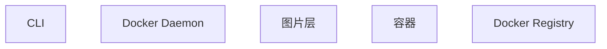

# 03. 架构与原理

Docker容器技术 的架构设计和核心原理。

## 系统架构

## 核心组件

### CLI

**职责**: 用户与Docker守护程序交互界面。

**交互**: 处理用户命令并交由Docker守护进程执行

### Docker Daemon

**职责**: Docker守护进程，负责Docker对象的管理和协调。

**交互**: 与外部API通信，管理Docker容器生命周期

### 图片层

**职责**: 构建镜像时的分层文件系统，使用联合文件系统技术。

**交互**: 镜像是由多个分层堆叠组成，提供读写层

### 容器

**职责**: Docker镜像的运行实例。

**交互**: 与宿主机网络，文件系统，资源调度交互

### Docker Registry

**职责**: 存储Docker镜像的服务。

**交互**: Docker Daemon从Registry拉取或推送镜像

## 核心工作流程

> 待补充：关键流程的时序图或流程图

---

**上一页**: [核心概念](./02-核心概念.md) | **下一页**: [实践指南](./04-实践指南.md)